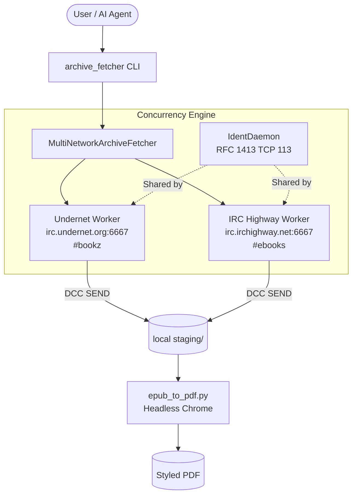

# Text Corpus Ingest

<div align="center">

[](LICENSE)
[](pyproject.toml)
[](scripts/test.sh)
[](https://github.com/astral-sh/ruff)
[](https://mypy-lang.org/)

**High-performance multi-network IRC search and automated DCC text corpus ingest engine.**

[Quick Start](#quick-start) •
[Architecture](#architecture) •
[Agent Instructions](#for-ai-agents--automation) •
[Usage](#usage) •
[EPUB to PDF](#epub-to-pdf-pipeline) •
[Configuration](#configuration) •
[Contributing](#contributing)

</div>

---

## Overview

Text Corpus Ingest is a lightweight, reliable Python framework designed to discover, fetch, and format text corpora and eBooks from IRC networks. It automates channel queries (`@search`), direct bot triggers, Direct Client-to-Client (DCC) file transfers, and downstream document formatting into local staging storage.

### Why Text Corpus Ingest?

- **Concurrent Multi-Network Ingest**: Searches both **Undernet** (`#bookz`) and **IRC Highway** (`#ebooks`) simultaneously in parallel worker threads.
- **Cooperative Cancellation**: When targeting a specific book or offer, the first network to deliver the file signals sibling networks to disconnect cleanly.
- **Robust DCC SEND Engine**: High-throughput socket streaming with 32-bit big-endian packet acknowledgements and strict path-traversal sanitization.
- **RFC 1413 Ident Daemon**: Embedded lightweight ident daemon on TCP port 113 to satisfy server authentication requirements.
- **Automated EPUB to PDF Pipeline**: Inlines media as data URIs, applies clean typographic styling, and renders publication-ready PDFs via headless Chrome/Chromium.
- **Zero-Bloat Foundation**: Built almost entirely on standard library sockets with minimal dependencies (`PyYAML`, `python-dotenv`).

---

## Architecture



---

## Quick Start

### 1. Installation

Clone the repository and run the setup script:

```bash
git clone https://github.com/rawshn97/text-corpus-ingest.git
cd text-corpus-ingest
./scripts/setup.sh
```

### 2. Basic Search

Search both Undernet and IRC Highway concurrently:

```bash
./scripts/run_fetch.sh -q "Frankenstein"
```

Search results and downloaded archives land directly in `staging/`.

---

## Usage

### 1. General Search (`@search`)

By default, the client joins `#bookz` on Undernet and `#ebooks` on IRC Highway, waits for network welcome, and broadcasts `@search {query}` to the channel and active bots:

```bash
./scripts/run_fetch.sh -q "babok"
```

### 2. Network-Specific Search

Filter execution to a single network with `--network`:

```bash
# Search IRC Highway only
./scripts/run_fetch.sh -q "babok" --network irchighway

# Search Undernet only
./scripts/run_fetch.sh -q "Frankenstein" --network undernet
```

### 3. Direct Bot Download (`--raw`)

When you know the exact bot trigger (e.g. from a search results list):

```bash
./scripts/run_fetch.sh --raw -q "!Bsk Business Analysis for Practitioners - A Practice Guide.epub" --hint "Business Analysis"
```

The `--raw` flag passes the query verbatim to the channel, while `--hint` ensures only the matching DCC offer is accepted.

### 4. Search Options Summary

| Option | Flag | Description |
|---|---|---|
| `--query` | `-q` | Search terms or raw bot trigger (required) |
| `--network` | `-n` | Target network (`all`, `undernet`, `irchighway`) |
| `--hint` | | Require substring in DCC filename before accepting |
| `--raw` | | Send query verbatim without `@search` prefix |
| `--stop-on-first` | | Stop all networks as soon as one download completes |
| `--all-results` | | Keep all networks running to collect all search results |
| `--verbose` | `-v` | Enable detailed debug logging |

---

## EPUB to PDF Pipeline

The project includes an automated converter in `scripts/epub_to_pdf.py` that transforms downloaded EPUB books into styled, printable PDFs using headless Google Chrome or Chromium.

### Features
- Inlines all chapter images as base64 data URIs.
- Applies professional book typography (A4 margins, clean font stacks, justified body text).
- Adds title cover page and page break rules.
- Automatically discovers Chrome/Chromium across macOS and Linux.

### Usage
```bash
.venv/bin/python scripts/epub_to_pdf.py "staging/book.epub" -o "staging/book.pdf"
```

---

## For AI Agents & Automation

This repository is optimized for autonomous AI agents and pairing workflows.

> [!IMPORTANT]
> Agents operating in this codebase should read [`AGENTS.md`](AGENTS.md) and load [`.cursor/skills/text-corpus-ingest/SKILL.md`](.cursor/skills/text-corpus-ingest/SKILL.md).

### Agent Ingestion Workflow
1. **Discover**: Run `./scripts/run_fetch.sh -q "<book title>"` to collect search lists from all responding networks into `staging/`.
2. **Inspect**: Inspect extracted `.txt` files in `staging/` to find active bot triggers (`!Bsk ...`, `!Ook ...`, `!peapod ...`).
3. **Fetch**: Execute `./scripts/run_fetch.sh --raw -q "!bot <filename>" --hint "<filename>"`.
4. **Format**: Convert inbound `.epub` files into PDF via `.venv/bin/python scripts/epub_to_pdf.py`.
5. **Verify**: Run `./scripts/test.sh` and `./scripts/lint.sh` before finishing.

### Rules for Agents
- **No Em Dash**: Never emit the `\u2014` character in any file, docstring, commit, or chat response.
- **Port 113 Safety**: Do not spin up multiple concurrent `IdentDaemon` instances. Use the shared daemon managed by `MultiNetworkArchiveFetcher`.
- **DCC Sanitization**: Always rely on `parse_dcc_send` for filename traversal prevention.

---

## Configuration

Default settings reside in [`config/irc.yaml`](config/irc.yaml). For machine-specific overrides (such as registered nicknames or passwords), create a gitignored `config/irc.local.yaml`:

```yaml
# config/irc.local.yaml (gitignored)
networks:
  - name: "undernet"
    identity:
      nick: "YourNick"
      x_username: "YourNick"
      x_password: "your-undernet-password"

  - name: "irchighway"
    identity:
      nick: "YourNick"
```

Environment variables in `.env` are also supported:
- `IRC_NICK`: Fallback IRC nickname.
- `IRC_X_PASSWORD`: Undernet CService (X) authentication password.
- `STAGING_DIR`: Custom destination directory for downloads.

---

## Directory Structure

```
text-corpus-ingest/
├── AGENTS.md                   # AI agent operating instructions
├── CLAUDE.md -> AGENTS.md      # Symlink for Claude / Anthropic agents
├── CONTRIBUTING.md             # Contribution guidelines
├── CODE_OF_CONDUCT.md          # Contributor code of conduct
├── LICENSE                     # MIT License
├── README.md                   # Project documentation
├── pyproject.toml              # Build metadata and tool configurations
├── requirements.txt            # Core dependencies
├── .cursor/
│   ├── rules/
│   │   └── text-corpus-ingest.mdc  # Cursor IDE always-on rules
│   └── skills/
│       └── text-corpus-ingest/
│           ├── SKILL.md        # Cursor agent skill definition
│           └── SKILL_CHANGELOG.md
├── config/
│   ├── irc.yaml                # Default multi-network configuration
│   └── irc.local.yaml          # Local overrides (gitignored)
├── scripts/
│   ├── epub_to_pdf.py          # EPUB to PDF conversion utility
│   ├── lint.sh                 # Lint and format checker (ruff + mypy)
│   ├── run_fetch.sh            # Ingest runner wrapper
│   ├── setup.sh                # Environment initialization script
│   └── test.sh                 # Test runner wrapper
├── src/
│   └── corpus_ingest/
│       ├── __init__.py         # Public library exports
│       ├── archive_fetcher.py  # Multi-network orchestrator and CLI
│       ├── config.py           # Dataclass models and YAML parser
│       ├── dcc.py              # DCC SEND protocol and file streamer
│       ├── identd.py           # RFC 1413 ident daemon (TCP 113)
│       └── irc_client.py       # Blocking socket IRC client
├── staging/                    # Inbound downloads (gitignored)
└── tests/                      # Pytest suite
    ├── test_dcc_parse.py
    ├── test_irc_wait.py
    ├── test_lab_resources.py
    ├── test_multi_network.py
    └── test_search.py
```

---

## Testing & Code Quality

Run tests with `pytest`:
```bash
./scripts/test.sh
```

Run static analysis and formatting checks:
```bash
./scripts/lint.sh
```

---

## Contributing

Contributions are welcome! Please see [`CONTRIBUTING.md`](CONTRIBUTING.md) and [`CODE_OF_CONDUCT.md`](CODE_OF_CONDUCT.md) for details on submitting pull requests.

---

## License

This project is licensed under the [MIT License](LICENSE).
